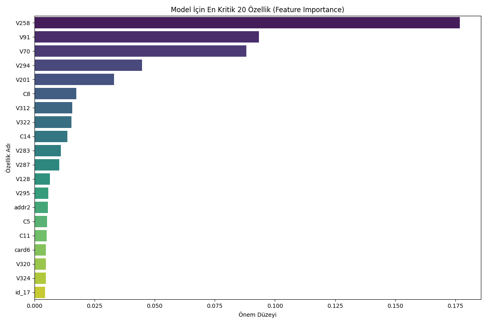

#  IEEE-CIS Fraud Detection Project

##  Proje Hakkında
Bu proje, finansal işlemlerde kredi kartı dolandırıcılığını (fraud) tespit etmek amacıyla geliştirilmiştir. IEEE-CIS veri seti kullanılarak, milyonlarca işlem arasından dolandırıcıları yakalayan bir Makine Öğrenmesi modeli kurulmuştur.

Büyük ölçekli ve dengesiz (imbalanced) veri setleri üzerinde çalışılmış, **Feature Engineering** teknikleri ile ham veri anlamlı hale getirilmiştir.

##  Kaggle Performans Gelişimi
Proje sürecinde model adım adım geliştirilmiş ve her aşamada performans artışı sağlanmıştır. Özellikle **Advanced Feature Engineering** aşamasında, veriden türetilen akıllı değişkenler sayesinde hem Public hem de Private skorlarda zirveye ulaşılmıştır.

| Versiyon | Yöntem | Public Score | Private Score | Sonuç |
|:---:|:---|:---:|:---:|:---|
| **v1.0** | Base XGBoost | 0.9102 | 0.8528 | Başlangıç Modeli |
| **v2.0** | XGBoost + Optuna | 0.9061 | 0.8597 | Daha Kararlı (Overfitting azaldı) |
| **v3.0** | **Feature Engineering** | **0.9155**  | **0.8632**  | **En Yüksek Performans!** |

> **Teknik Not:** v3 sürümünde eklenen *Aggregation Features* (Ortalamadan sapma analizleri) ve *Frequency Encoding* (Sıklık analizleri) sayesinde model, dolandırıcılık kalıplarını çok daha net tespit etmiştir.

> **Analiz:** v2 modelinde Public Score hafif düşmesine rağmen, gerçek veri setini temsil eden **Private Score artmıştır.** Bu durum, Optuna optimizasyonunun modeldeki ezberlemeyi (overfitting) azalttığını ve modelin gerçek hayatta daha başarılı olacağını göstermektedir.

* **Local ROC-AUC:** `0.9708` (Eğitim sırasındaki validasyon skoru)

##  Modelin "Dolandırıcıyı" Yakalama Kriterleri (Feature Importance)
Modelimiz, işlemleri analiz ederken aşağıdaki özelliklere dikkat etmektedir. Grafikte dolandırıcılığı en çok ele veren faktörler görülmektedir:



## 🛠️ Kullanılan Teknolojiler ve Yöntemler
* **Python:** Ana geliştirme dili
* **XGBoost:** Sınıflandırma modeli
* **Pandas & NumPy:** Veri işleme ve manipülasyon
* **Matplotlib & Seaborn:** Veri görselleştirme
* **İleri Seviye Teknikler:**
    * **Data Leakage Prevention:** Time-series split ve Index Slicing yöntemleri
    * **Class Imbalance Handling:** `scale_pos_weight` optimizasyonu
    * **Modular Architecture:** `src/` klasörü altında temiz kod yapısı

##  Kurulum
Projeyi kendi bilgisayarınızda çalıştırmak için:

```bash
# 1. Repoyu klonlayın
git clone [https://github.com/MehmetcanMutlu/Fraud-Detection-Analysis.git](https://github.com/MehmetcanMutlu/Fraud-Detection-Analysis.git)

# 2. Gerekli kütüphaneleri yükleyin
pip install -r requirements.txt

# 3. Kaggle veri setlerini 'input' klasörüne indirin.

# 4. Modeli eğitin ve tahmin üretin
python3 submission.py